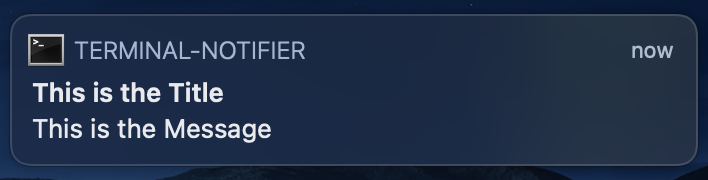

# addRem
addRem is a command-line tool to add reminders for online classes/events
## Usage
- Note that you do have to give your terminal application administrative control to use addRem since it uses cron to remind you.
- First clone this repository: `git clone https://github.com/jonathanbcarlson/addRem`
- There are two ways to use addRem
  #### 1. inside addRem/ 
    - after cloning the repo cd to where the addRem script is: `cd addRem`
    - Now run addRem: `./addRem`
  #### 2. from anywhere
    - export the addRem script to your `$PATH` in your .bashrc or .zshrc or equivalent shell rc file using:
      ```bash 
      export PATH="LOCATION_OF_addRem":$PATH"
      ```
    - run `addRem` anywhere you want
- Then answer questions about:
  - The name of the event
  - The online class link (e.g. Zoom link)
  - Which days and at what time you want to be reminded at 
  - Where you want the reminder scripts to be stored
- You will later see a terminal-notifier notification pop up at the date and time you specified. 
  - It should like this: 
- To join the online meeting, simply click the notification and it will take you to the online meeting link you typed in earlier.
## Dependencies:
- [terminal-notifier](https://github.com/julienXX/terminal-notifier)
- macOS
## Known issues
- If you try to use environmental variables like `$HOME` when specifying the directory where reminders are stored, you first need to export the variable to use it in addRem. 
- I've currently only added support for `$HOME`, which you can use by setting it to `remHome` and then exporting remHome
  - For example you can add this to your .bashrc or equivalent shell rc file
    ```bash 
    remHome=$HOME 
    export remHome
    ```
    Then when you specify where you want to store reminders shell scripts: type`$remHome`
## TODO:
- [x] have user specify location of where reminders are stored
  - [x] have default
- [x] put commas between separate days instead of separated by space (e.g. instead of 1 3 use 1,3)
- [ ] have user say where terminal-notifier is stored
  - [ ] have mine as default
     - have this only happen first time addRem is executed, or just make it an environmental variable like remHome? 
- [x] give ability for user to change message of notification
- [x] check that Y works for confirming zoom
- [ ] add ability to delete crontabs
- [ ] add abiity for user to specify not just per week for crontab (e.g. a weekly scheduled meeting) but any day of the month (basically use all of crontab)
- [ ] maybe instead of having environement variables, have the user put it in a config file e.g. ~/.config/addRem.toml
     - then have to parse :( 
- [x] create reminders folder for reminders in specified directory location
- [x] add part of exporting addRem to path in .zshrc or .bashrc
- [ ] add a simple y/n if you want to have the title as the same name as the event name - similar to zoom link confirmation
- [ ] add a default path for reminders folder by adding it in .zshrc, with confirmation of if you want default - similar to zoom link confirmation
- [ ] add ability to see all reminders and their times
- [ ] fails if just uses $remHome for where reminder is stored


